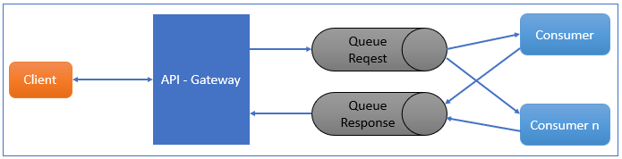

# Microservice Async RabbitMQ

This is an experimental Microservice use Spring, RabbitMQ Resquest-Response pattern.

Sample to show how RabbitMQ can used for the communication between microservices.

It use two microservices:
* API-Gateway Service. This services receive the message request from the client and send the message to RabbitMQ. These services listen RabbitMQ to get the message and return a response to the client.
  
* Consumer Service. This services listen to the message from RabbitMQ and process message and then send the message to RabbitMQ.


### Requirements:
1. Java 8
2. Maven
3. RabbitMQ Server

### Installation (on Ubuntu)
1. Install RabbitMQ
  ```Shell
    # Step 1: Install Erlang
    $ sudo apt-get update
    $ sudo apt-get install erlang erlang-nox

    # Step 2: Install RabbitMQ Server
    $ echo 'deb http://www.rabbitmq.com/debian/ testing main' | sudo tee /etc/apt/sources.list.d/rabbitmq.list
    $ wget -O- https://www.rabbitmq.com/rabbitmq-release-signing-key.asc | sudo apt-key add -
    
    $ sudo apt-get update
    $ sudo apt-get install rabbitmq-server
    
    # Step 3: Start RabbitMQ Server
    $ sudo /etc/init.d/rabbitmq-server restart
    
    # Step 4: Create Admin User
    $ sudo rabbitmqctl add_user admin 123456
    $ sudo rabbitmqctl set_user_tags admin administrator
    $ sudo rabbitmqctl set_permissions -p / admin ".*" ".*" ".*"
  ```  
2. Install JDK 8
  ```Shell
    $ sudo add-apt-repository ppa:webupd8team/java
    $ sudo apt-get update
    $ sudo apt-get install oracle-java8-installer
    $ sudo apt-get install oracle-java8-set-default    
  ```
3. Install maven
  ```Shell
    $ sudo apt-get install maven
  ```
2. Clone Source Code
  ```Shell
    # Make sure to clone with --recursive
    git clone https://github.com/thangntt/microservice-async-rabbitmq.git
  ```
3. Run application
  ```Shell
    # Open new terminal and run microservice-api-gateway
    $ cd microservice-object-message
   $ mvn clean install
   
    # Open new terminal and run microservice-api-gateway    
    $ cd microservice-api-gateway
    $ mvn spring-boot:run
  
    # Open new terminal and run microservice-service-consumer  
   # Create more consumer with more termial
   $ cd microservice-service-consumer
    $ mvn spring-boot:run  
  ```

### Demo
1. Open browser app and execute url: http://127.0.0.1:8080/test
2. View console 

    Console: microservice-api-gateway  
    ```Shell
    ======================= Begin ======================
    Thread: http-nio-8080-exec-1 Id: 4
    doSomeThing1()
    Success Response with Id: 4
    ======================= Done =======================    
    ```

    Console: microservice-service-consumer
    ```Shell
    Received: id: 4 - data: testqueue
    ```

### How to import project into eclipse
  
1. Build maven eclipse
  ```Shell    
    $ cd microservice-object-message
    $ mvn eclipse:eclipse
    $ cd microservice-api-gateway
    $ mvn eclipse:eclipse
    $ cd microservice-service-consumer
    $ mvn eclipse:eclipse
  ```
2. Import protject into eclipse 
    In Eclipse choice File -> Import -> Existing Projects into Workspace
